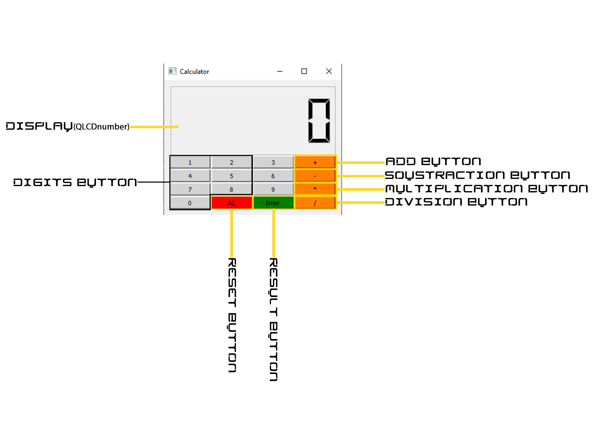

# Signals and slots

## Definition

Signals and slots are used for communication between objects. The signals and slots mechanism is a central feature of Qt and probably the part that differs most from the features provided by other frameworks. Signals and slots are made possible by Qt's

## **Objective**

This exercise follows up to add interactive functionality to the calculator widgets written in the previous homework. The goal is to use Signals and Slots to simulate a basic calculator behavior. The supported operations are *, +, -, /


 -  [**Calculator-Interface**](#calculator-interface)
 
 -  [**Main-Class**](#main-class)
 
 -  [**Calculator**](#calculator)
  
 -  [**Functionnalites-of-each-components**](#functionnalites-of-each-components)
 
# Calculator-Interface


For now our `application` has no reactivity. The goal of the rest of the section is to obtain step/step a fully functional widget.

# Main-Class

```c++
int main(int argc, char *argv[])
{
    QApplication a(argc, argv);
    Calculator w;
    w.setWindowTitle("Calculator");
    w.resize(250,250);
    w.show();
    return a.exec();
}
```
# Calculator
In order to have a computing functionality, we will represent any mathematical operation by:
```
        left   (operation)  right
   ex:   3          +         9
```
- ## **Calculator.h**

```c++
class Calculator : public QWidget
{
    Q_OBJECT
public:
    Calculator(QWidget *parent = nullptr);
    ~Calculator();
  public  slots:
    void   newDigit();
void changeOperation();
void showresult();
void reset();

//void onClicked();
void newDigitCL(QKeyEvent *e);
 // Add you custom slots here
protected:
    void createWidgets();        //Function to create the widgets
    void placeWidget();         // Function to place the widgets
    void makeConnexions();     // Create all the connectivity

//events
protected:
    void keyPressEvent(QKeyEvent *e)override;     //Override the keypress events

private:
    QGridLayout *buttonsLayout; // layout for the buttons
    QVBoxLayout *layout;        //main layout for the button
    QVector<QPushButton*> digits;  //Vector for the digits
    QPushButton *enter;            // enter button
    QPushButton *AC;            // enter button

    QVector<QPushButton*> operations; //operation buttons
    QLCDNumber *disp;// Where to display the numbers
private:
    double * left=nullptr;          //left operand
    double * right=nullptr;         // right operand
    QString *operation=nullptr;  // Pointer on the current operation
};
#endif // CALCULATOR_H
```
- ## **Calculator.cpp**

```c++
Calculator::Calculator(QWidget *parent)
    : QWidget(parent)
{
    createWidgets();
    placeWidget();
    makeConnexions();

}
Calculator::~Calculator()
{
    delete disp;
    delete layout;
    delete buttonsLayout;
}
void Calculator::createWidgets()
{
    //Creating the layouts
    layout = new QVBoxLayout();
    layout->setSpacing(2);
    //grid layout
    buttonsLayout = new QGridLayout;
    //creating the buttons
    for(int i=0; i < 10; i++)
    {
        digits.push_back(new QPushButton(QString::number(i)));
        digits.back()->setSizePolicy(QSizePolicy::Expanding, QSizePolicy::Fixed);
        digits.back()->resize(sizeHint().width(), sizeHint().height());
        digits.back()->setStyleSheet("QPushButton { background-color: grey; }\n"
                                         "QPushButton:enabled { background-color: rgb(211,211,211); }\n");
    }
    //enter button
    enter = new QPushButton("Enter",this);
    enter->setSizePolicy(QSizePolicy::Expanding, QSizePolicy::Fixed);
    enter->resize(sizeHint().width(), sizeHint().height());
    enter->setStyleSheet("QPushButton { background-color: grey; }\n"
                                     "QPushButton:enabled { background-color: rgb(0,128,0); }\n");
    AC = new QPushButton("AC",this);
    AC->setSizePolicy(QSizePolicy::Expanding, QSizePolicy::Fixed);
    AC->resize(sizeHint().width(), sizeHint().height());
    AC->setStyleSheet("QPushButton { background-color: grey; }\n"
                                     "QPushButton:enabled { background-color: rgb(255,0,0); }\n");
    //operatiosn buttons
    operations.push_back(new QPushButton("+"));
    operations.back()->setStyleSheet("QPushButton { background-color: grey; }\n"
                                     "QPushButton:enabled { background-color: rgb(255,128,0); }\n");
    operations.push_back(new QPushButton("-"));
    operations.back()->setStyleSheet("QPushButton { background-color: grey; }\n"
                                     "QPushButton:enabled { background-color: rgb(255,128,0); }\n");
    operations.push_back(new QPushButton("*"));
    operations.back()->setStyleSheet("QPushButton { background-color: grey; }\n"
                                     "QPushButton:enabled { background-color: rgb(255,128,0); }\n");
    operations.push_back(new QPushButton("/"));
    operations.back()->setStyleSheet("QPushButton { background-color: grey; }\n"
                                     "QPushButton:enabled { background-color: rgb(255,128,0); }\n");
    //creating the lcd
    disp = new QLCDNumber(this);
    disp->setDigitCount(6);
}

void Calculator::placeWidget()
{
    layout->addWidget(disp);
    layout->addLayout(buttonsLayout);
    //adding the buttons
    for(int i=1; i <10; i++)
        buttonsLayout->addWidget(digits[i], (i-1)/3, (i-1)%3);
    //Adding the operations
    for(int i=0; i < 4; i++)
        buttonsLayout->addWidget(operations[ i], i, 4);
    //Adding the 0 button
    buttonsLayout->addWidget(digits[0], 3, 0);
    buttonsLayout->addWidget(enter, 3, 2, 1,1);
    buttonsLayout->addWidget(AC, 3, 1, 1,1);
    setLayout(layout);
}
void Calculator::makeConnexions()
{
    for(int i=0; i <10; i++)
        connect(digits[i], &QPushButton::clicked,
                this, &Calculator::newDigit);
    for(int i=0; i <4; i++)
        connect(operations[i], &QPushButton::clicked,
                this, &Calculator::changeOperation);
    connect(enter,&QPushButton::clicked,this,&Calculator::showresult);
    connect(AC,&QPushButton::clicked,this,&Calculator::reset);
}
void Calculator::newDigitCL(QKeyEvent *e )
{
    //getting the value
    double value = e->text().toInt();
    //Check if we have an operation defined

            if(!left)
                left = new double{value};
            else
                *left = 10 * (*left) + value;

            disp->display(value);
        }

        void Calculator::newDigit( )
        {
            //getting the sender
            auto button = dynamic_cast<QPushButton*>(sender());

            //getting the value
            double value = button->text().toInt();

            //Check if we have an operation defined
                if(operation)
                {
                    //check if we have a value or not
                    if(!right)
                        right = new double{value};
                    else
                        *right = 10 * (*right) + value;

                    disp->display(*right);

                }
                else
                {
                    if(!left)
                        left = new double{value};
                    else
                        *left = 10 * (*left) + value;

                    disp->display(*left);
                }
}
void Calculator::changeOperation()
{
    //Getting the sender button
    auto button = dynamic_cast<QPushButton*>(sender());
    //Storing the operation
    operation = new QString{button->text()};
    //Initiating the right button
    right = new double{0.0};
    //reseting the display
    disp->display("r");
}
void Calculator::showresult(){
    //Getting the sender button
    auto button = dynamic_cast<QPushButton*>(sender());
    //Storing the operation
   enter = new QPushButton{button};
 if(*operation=="+")  { disp->display(*left+(*right)); *left= *left+(*right);}
 else if(*operation=="-")  { disp->display(*left-(*right));*left= *left-(*right);}
else if(*operation=="*")  { disp->display(*left*(*right));*left= *left*(*right);}
else  if(*operation=="/")  {
     if(*right==0) disp->display("error");
     else disp->display(*left/(*right));*left= *left/(*right);}
else  disp->display(*left);
}
void Calculator::reset(){
    right = new double{0.0};
    left = new double{0.0};
    operation=nullptr;
    disp->display(0);
}
void Calculator::keyPressEvent(QKeyEvent *e)
{
    //Exiting the application by a click on space
    if( e->key() == Qt::Key_Escape)
        qApp->exit(0);
    if( e->key() == Qt::Key_1) newDigitCL(e);
    if( e->key() == Qt::Key_2)
        newDigitCL(e);
    if( e->key() == Qt::Key_3)
        newDigitCL(e);
    if( e->key() == Qt::Key_4)
       newDigitCL(e);
    if( e->key() == Qt::Key_5)
        newDigitCL(e);
    if( e->key() == Qt::Key_6)
        newDigitCL(e);
    if( e->key() == Qt::Key_7)
        newDigitCL(e);
    if( e->key() == Qt::Key_8)
        newDigitCL(e);
    if( e->key() == Qt::Key_9)
        newDigitCL(e);
    if( e->key() == Qt::Key_0)
        newDigitCL(e);
}
```
## Functionnalites-of-each-components

